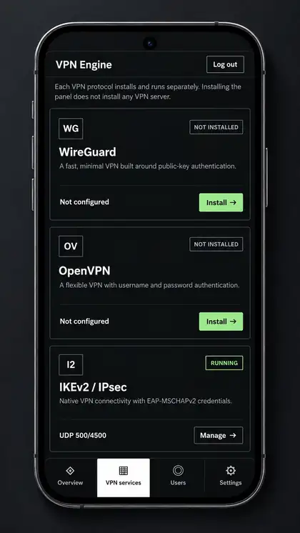
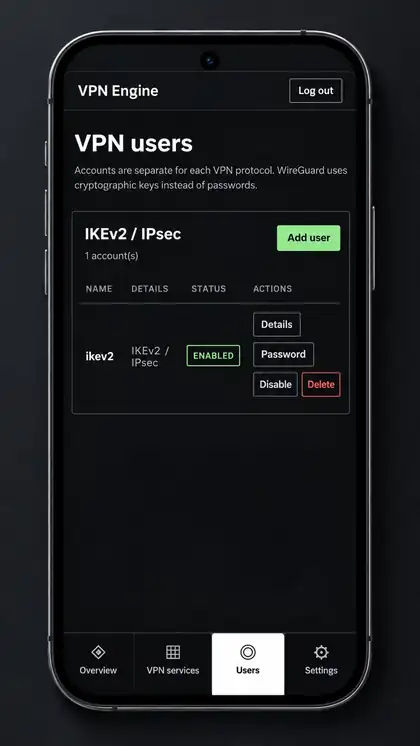

# VPN Engine

VPN Engine is a self-hosted web panel that installs and manages WireGuard, OpenVPN and IKEv2/IPsec on one supported Linux server. The first install adds the management panel; VPN protocols are installed individually from the web UI.

On a server with a public IPv4 address and available TCP ports 80 and 443, the installer configures HTTPS with a Let's Encrypt IP address certificate.

Supported releases: **Ubuntu 24.x, Ubuntu 26.x, Debian 12 and Debian 13**.

The installer warns when it detects another distribution or release, but it does not stop on other APT-based systems. Non-APT systems are not supported.

<p align="center">
  
  
</p>

## What it manages

| Protocol | Authentication | Default port | Default network |
| --- | --- | ---: | --- |
| WireGuard | Key pair | UDP 123 | `10.66.66.0/24` |
| OpenVPN | Username and password | UDP 1194 | `10.67.67.0/24` |
| IKEv2/IPsec | EAP-MSCHAPv2 username and password | UDP 500 + 4500 | `10.68.68.0/24` |

Each protocol has its own configuration, users and service controls. Installing or stopping one does not require stopping the others.

## Install

Run on a fresh supported server. The command below also installs `curl` and CA certificates when a minimal image does not include them.

```bash
sudo bash -c 'command -v curl >/dev/null 2>&1 || { apt-get update && apt-get install -y ca-certificates curl; }; curl -fsSL https://raw.githubusercontent.com/yulcaribe/vpnengine/main/install.sh | bash'
```

If you are already root:

```bash
command -v curl >/dev/null 2>&1 || { apt-get update && apt-get install -y ca-certificates curl; }; curl -fsSL https://raw.githubusercontent.com/yulcaribe/vpnengine/main/install.sh | bash
```

The installer asks for the internal admin backend TCP port. The default is `51821`. Source compilation needs temporary disk space and memory; the Go toolchain is used only during installation unless it was already installed by the administrator.

When the server has a public IPv4 address and inbound TCP ports 80 and 443 are available, the installer automatically:

- installs nginx as the HTTPS reverse proxy
- requests a Let's Encrypt short-lived IP address certificate
- redirects HTTP to HTTPS
- binds the VPN Engine application backend to `127.0.0.1`
- enables automatic certificate renewal

After a successful HTTPS setup, open:

```text
https://SERVER_IP
```

Let's Encrypt IP address certificates are short-lived (about six days), so VPN Engine checks for renewal twice per day and reloads nginx only when a certificate is renewed.

If certificate issuance fails (including Let's Encrypt rate limits), the installer falls back to **public, unencrypted HTTP automatically** without a terminal prompt or `--allow-http` option. The direct panel is then available at:

```text
http://SERVER_IP:51821
```

After installation, open the panel URL to create your **admin username and password**. There is no temporary setup code. Sign in with the credentials you chose, then install VPN protocols from **VPN services**.

**Security warning:** The admin setup form has no confirmation or temporary setup code. When HTTPS fails, public HTTP opens automatically, meaning passwords and VPN settings are unencrypted in transit. Anyone who reaches an uninitialized panel first can create its administrator account. Complete setup immediately after installation, preferably over HTTPS or through an SSH tunnel. After account creation, first-time setup is permanently closed.

## Update

Run the same install command on an existing server. The installer resolves a specific GitHub main commit, downloads its source and compiles it on the target server. A suitable existing Go installation is reused and never removed. Otherwise an official Go toolchain is temporarily downloaded, SHA-256 verified, and deleted after installation. Sources, archives and Go build caches live in a private temporary folder and are cleared even after an installation failure. The existing panel binary and frontend configuration are backed up, with rollback preserved. It checks the new backend and previously working HTTPS endpoint, and automatically restores the previous panel if the update fails. VPN accounts, keys, certificates and protocol settings are retained.

Existing configured HTTP installations remain reachable if HTTPS cannot be configured. Incomplete legacy setups are restricted during rollback; v1.1.8 and later do not require a setup code.

OpenVPN installations receive local connection controls during the first upgrade. This requires one restart of the managed OpenVPN service; clients can reconnect with their existing profiles. IKEv2 credentials and connections are refreshed through the local strongSwan control socket without restarting the daemon.

## Admin access and user controls

Admin sessions expire after 30 minutes without activity, with an absolute limit of 12 hours. Automatic task progress checks do not extend an idle session. Changing the admin username or password signs out existing sessions. After eight failed login attempts from one address, that address is temporarily locked for five minutes.

Disabling or deleting a VPN account, or changing its password, also disconnects its active connections. If a runtime control fails, the saved access restriction is kept and the panel reports that disconnection could not be verified. Refresh shows the saved state. During revocation, unidentified OpenVPN or IKEv2 handshakes may also be interrupted; those clients can retry.

Use **Refresh** to check service state. The panel shows the last successful check and offers **Retry** after a connection failure. Long operations continue on the server if the admin session expires; sign in again to check their progress.

## WireGuard

VPN Engine creates its own interface:

```text
vpnwg0
```

It does not use the usual `wg0` name, which avoids taking over a manually configured `wg0`.

WireGuard users are device profiles rather than username/password accounts. Adding a user creates a key pair and an address from the configured VPN subnet.

For each WireGuard device, the panel provides:

- client configuration
- QR code
- assigned VPN address

Default service:

```text
wg-quick@vpnwg0
```

## OpenVPN

OpenVPN uses username/password authentication.

VPN Engine creates:

```text
/etc/openvpn/server/vpnengine.conf
```

and runs:

```text
openvpn-server@vpnengine
```

Client profiles contain the CA certificate and `tls-crypt` key. User passwords are not written into the `.ovpn` file. OpenVPN Connect asks for the username and password when the profile connects.

The managed tunnel interface is:

```text
tun-vpneng
```

## IKEv2/IPsec

IKEv2 is provided by strongSwan and uses EAP-MSCHAPv2.

The server generates its own CA and server certificate. Download the CA certificate from the panel and install it on the client before connecting.

Typical client settings are:

```text
Type: IKEv2/IPsec MSCHAPv2
Server: your server IP or hostname
Username: VPN Engine user
Password: VPN Engine password
```

IKEv2 uses both:

```text
UDP 500
UDP 4500
```

IKEv2 credentials are stored locally on the server for strongSwan authentication.

## Service controls

Each installed protocol can be controlled separately from the panel:

```text
Start
Stop
Restart
Remove
Logs
```

Removing a protocol removes its VPN Engine configuration and accounts without removing the panel or the other VPN protocols.

## Network requirements

VPN Engine enables IPv4 forwarding and creates the forwarding and NAT rules needed by its VPN networks.

The VPS provider firewall is still your responsibility.

Allow:

- TCP 80 and 443 for automatic HTTPS and certificate validation
- the internal admin panel TCP port only when HTTPS setup falls back to direct HTTP
- the selected WireGuard UDP port
- the selected OpenVPN UDP port
- UDP 500 and 4500 for IKEv2

The VPN subnets must not overlap with networks already in use on the server.

VPN Engine does not manage cloud security groups or provider-side firewalls.

## IPv6

New protocol installations offer IPv6 when the server has a working IPv6 address, route and internet connection. The **Settings > Server IPv6 connectivity** panel shows whether host IPv6 internet access was detected. If IPv6 is unavailable, the panel explains that this does not prove a VPN Engine installation failure: the ISP/VPS provider may not assign IPv6, or the server IPv6 address, default route or network configuration may be missing or incorrect. IPv4 remains available. Existing IPv4 installations keep their current configuration until you turn IPv6 on from the protocol page. Each protocol uses a separate private IPv6 subnet and IPv6 forwarding/NAT rules; its IPv4 subnet, keys and accounts remain the same.

After switching IPv6 on or off, reconnect devices. For WireGuard and OpenVPN, download and import the updated client profiles. WireGuard profiles route IPv6 into the tunnel even when server-side IPv6 is off; compatible OpenVPN clients receive IPv6 blocking instructions. Previously imported profiles do not automatically change.

Native IKEv2 clients handle IPv6 differently. When IPv6 tunneling is unavailable, some devices can send IPv6 outside the VPN. Check the actual device rather than assuming that IPv6-off guarantees leak protection.

## Uninstall

The uninstall script removes VPN Engine and the VPN stack it manages:

```bash
curl -fsSL https://raw.githubusercontent.com/yulcaribe/vpnengine/main/uninstall.sh | sudo bash
```

It stops the VPN Engine panel and its managed VPN protocols, deletes their service configs and private state, removes tagged IPv4/IPv6 firewall and NAT rules (including orphaned rules), the VPN Engine HTTPS configuration, certificates, renewal setup, runtime sockets and installer temporary folders.

**Shared system packages are retained**, including Go installations that existed before setup, VPN protocol packages, nginx and host networking tools. The uninstaller does not blindly disable global IP forwarding because other services might still need it. Deleting the VPN Engine sysctl files stops its settings from being reapplied on the next boot.

Packages installed for no other purpose can be manually removed after verifying no other application depends on them.

## Files

Main paths used by VPN Engine:

```text
/usr/local/bin/vpn-engine
/etc/vpn-engine/
/etc/vpn-engine/state.json
/etc/vpn-engine/services/
/etc/vpn-engine/pki/

/etc/wireguard/vpnwg0.conf
/etc/openvpn/server/vpnengine.conf
/etc/swanctl/conf.d/vpn-engine.conf

/etc/systemd/system/vpn-engine.service

/etc/nginx/sites-available/vpn-engine
/etc/systemd/system/vpn-engine-cert-renew.timer
/opt/vpn-engine-certbot/
```

## Server requirements

Supported releases:

```text
Ubuntu 24.x
Ubuntu 26.x
Debian 12
Debian 13
```

Server requirements:

```text
systemd
root access
IPv4
APT package manager
```

Supported architectures:

```text
amd64
arm64
```

## Development checks

CI uses Go 1.27 to test Linux amd64/arm64 builds, without publishing any binaries:

```bash
go test -race ./...
go vet ./...
bash -n install.sh uninstall.sh
node --check web/app.js
```

Tests cover atomic first-admin setup, authentication races, session expiry, scoped connection controls, IPv6 rules and installer rollback using temporary files and local test sockets. They do not replace real VPN tests: on Android/Samsung, iOS and Windows, check connectivity, DNS, public IPv4/IPv6, reconnect after a profile update, and disconnect after account disable/delete/password change.

The installer does not use GitHub Releases. Every install/update builds the pinned current main commit on the target server and identifies it with the source version and commit ID. GitHub Actions only runs tests and build checks.

## Issues and contributions

Bug reports, security issues, feature requests and pull requests are welcome through GitHub.
